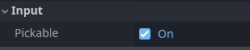
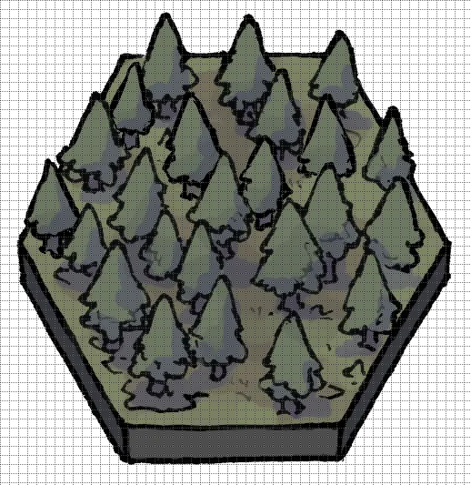
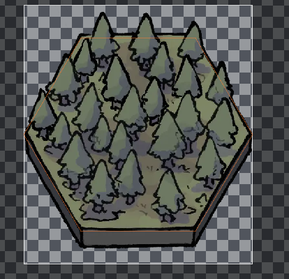
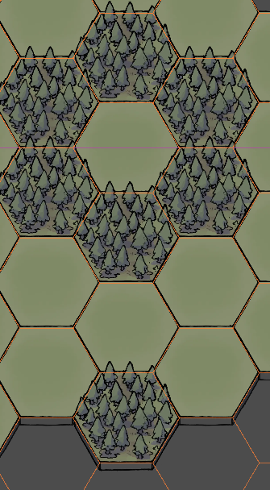

# Godot-HowTos

This is a doc of my personal learning notes of Godot game engine (version 4.4 as the time of writing). A list of how-tos for a lot of atomic tasks. More sophisticated examples will be in their own directories under `examples/` with more detailed setup and documentations.

<details>
<summary>
How to select a character by mouse click
</summary>

### How to select a character by mouse click

Assuming the character/unit is an `CharacterBody2D` or any subclass of `CollisionObject2D` type:
- Create an input action for left mouse button (or right button) in InputMap within the project setting.
- The `Input/Pickable` property of the `CharacterBody2D` node needs to be set to on

    
- Connect the `input_event` signal to a handler function in the script, e.g. `_on_input_event`
- Within the `_on_input_event` function:

```
func _on_input_event(viewport: Node, event: InputEvent, shape_idx: int) -> void:
	if event is InputEventMouseButton:
		if event.is_action("mouse_left"):
            # do stuff here
			is_selected = true
```
</details>

<details>
<summary>
How to implement a in-game popup window
</summary>

### How to implement a in-game popup window

- Create a node of `Window` type
    - You could also use other `Control` types such as `Panel` but the `Window` type has more built-in implementations
- Draw the UI within the `Window` node
- Create InputMap key that triggers the popup, e.g. "tab"
- Attach script:

```
func _ready() -> void:
    # not shown by default
    hide()

func _input(event: InputEvent) -> void:
	if event.is_action_pressed("tab"):
		if visible:
			hide()
		else:
			show()
```
</details>

<details>
<summary>
How to move camera following mouse position (RTS style)
</summary>

### How to move camera following mouse position (RTS style)

e.g. if you want to move the camera to the right when mouse is near the right edge of the viewport
- Add `Camera2D` child node to the "world" or map node
- Attach script to the `Camera2D` node
- Script:

```
# camera2d

# pan speed
@onready var pan_speed = 400
# move the camera if the mouse is near the edge, in a real project these should be relative the viewport size
@onready var left_margin = 20  
@onready var right_margin = 1200 - 20  
@onready var top_margin = 800 - 20
@onready var bottom_margin = 20

func _process(delta: float) -> void:
    var move_up_down: float = 0
	var move_left_right: float = 0
	var distance = delta * pan_speed
	var mouse_pos = get_viewport().get_mouse_position()
	
	if Input.is_action_pressed("ui_left") or mouse_pos.x < left_margin:
		move_left_right = -1
	if Input.is_action_pressed("ui_right") or mouse_pos.x > right_margin:
		move_left_right = 1
	if Input.is_action_pressed("ui_up") or mouse_pos.y < top_margin:
		move_up_down = -1
	if Input.is_action_pressed("ui_down") or mouse_pos.y > bottom_margin:
		move_up_down = 1
	var move_vec = Vector2(move_left_right * distance, move_up_down * distance)
	if move_vec.length() > 0:
		position = position + move_vec
```

</details>

<details>
<summary>
How to zoom in and out with mouse wheel (RTS style)
</summary>

### How to zoom in and out with mouse wheel (RTS style)

- Set InputMap actions, e.g. "mouse_scroll_up" and "mouse_scroll_down"
- Add `Camera2D` child node to the "world" or map node
- Attach script to the `Camera2D` node
- Script:
```

# zoom scale is 2D vec on both x and y
@onready var zoom_speed = Vector2(0.1, 0.1)
func _process(delta: float) -> void:
	if Input.is_action_just_pressed("mouse_scroll_up"):
		var next_zoom = zoom + zoom_speed
		zoom = next_zoom.clamp(Vector2(0.5, 0.5), Vector2(2.0, 2.0))
	if Input.is_action_just_pressed("mouse_scroll_down"):
		var next_zoom = zoom - zoom_speed
		zoom = next_zoom.clamp(Vector2(0.5, 0.5), Vector2(2.0, 2.0))
```
</details>

<details>
<summary>
How to create irregular hexagonal tile maps?
</summary>

### How to create irregular hexagonal tile maps?

I'm using this asset of hex tiles which have some issues fitting into the Godot hex tilemaps:
1. The hexagons are not perfectly symmetrical. e.g. the dimensions are 480x406.
2. The textures "overflows" the bounds of the hexagon. e.g.



Here is what I did in Godot to make tiles fit nicely:

1. Create `TileMapLayer` node, select Hexagon tiles, set tile size to match the actual "inner" hexagon size of the tiles. (480x406)
2. Change "Tile Offset Axis" to "Vertical Offset" in this case to match the orientation of the tile texture.
3. Import the texture/asset. In "TileSet" -> "Setup", adjust "Margins" and "Texture Region Size" such that:

	a. The hexgon tile box mostly aligns with the "inner" bounds of the texture

	b. The region should not cut off the "overflow" part of the texture. It should look something like this:

	
4. **Change "Tile Layout" to "Diamond Down"**, this essentially changes how the coordinates of the tiles are oriented, and by using "Diamond Down", it will make proper rendering decision for this type of tile textures: the correct edges are covered by adjacent tiles, while the "overflow" part will over the adjacent tiles. Example:



5. Duplicate the setup in 3) to other textures using the following method

### How to duplicate TileSet setup to different textures?

The asset pack I'm using unfortunately does not come with an atlas and unfortunately we have to create and setup each individual tileset. But Fortunately this can be done quickly.

1. Save the corrected tile set to a ".tres" file. Using a text editor, the relevant part should look something like this:

```
[sub_resource type="TileSetAtlasSource" id="TileSetAtlasSource_peyie"]
texture = ExtResource("1_ujgj0")
margins = Vector2i(227, 140)
texture_region_size = Vector2i(480, 543)
0:0/0 = 0
```
2. In Godot, import other textures into tile sets, do not change any setup. Save.
3. Reopen/Refresh the ".tres" file. Edit copy pastes the corresponding properties ("margins" and "texture_region_size" in this case) to all applicable entries. e.g.


```
[sub_resource type="TileSetAtlasSource" id="TileSetAtlasSource_peyie"]
texture = ExtResource("1_ujgj0")
margins = Vector2i(227, 140)
texture_region_size = Vector2i(480, 543)
0:0/0 = 0

[sub_resource type="TileSetAtlasSource" id="TileSetAtlasSource_x7jcc"]
texture = ExtResource("2_02c43")
margins = Vector2i(227, 140)
texture_region_size = Vector2i(480, 543)
0:0/0 = 0

[sub_resource type="TileSetAtlasSource" id="TileSetAtlasSource_3j5wi"]
texture = ExtResource("3_02c43")
margins = Vector2i(227, 140)
texture_region_size = Vector2i(480, 543)
0:0/0 = 0
```

4. Save the edits in ".tres" file. Godot should referesh to reflect the changes.

</details>