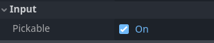

# Godot-HowTos

This is a doc of learning notes of Godot game engine (version 4.4 as the time of writing). A list of how-tos for a lot of atomic tasks.

### How to select a node/character/unit by mouse click

Assuming the character/unit is an `CharacterBody2D` or any subclass of `CollisionObject2D` type:
- Create an input action for left mouse button (or right button) in InputMap within the project setting.
- The `Input/Pickable` property of the `CharacterBody2D` node needs to be set to on

    
- Connect the `input_event` signal to a handler function in the script, e.g. `_on_input_event`
- Within the `_on_input_event` function:

```
func _on_input_event(viewport: Node, event: InputEvent, shape_idx: int) -> void:
	if event is InputEventMouseButton:
		if event.is_action("mouse_left"):
            # do stuff here
			is_selected = true
```

### How to 