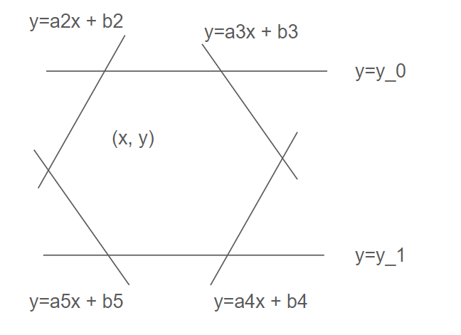
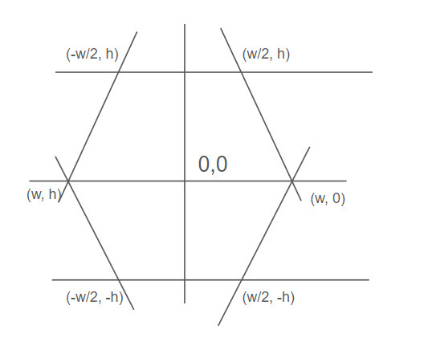

# How to create shader for irregular hexagon tiles in Godot?

## What does this shader do?

https://github.com/user-attachments/assets/01895977-45be-4d92-951c-2581a52ae2fd

The shader in this example project will highlight a hexagon tile in a Godot TileMapLayer which tracks the mouse movement.
(tile map from https://2minutetabletop.com/)

Features:
- Works for *certain irregular* hexagons (e.g. when height != width, but still symmetrical)
- Works for vertical offset, aka "flat top" layout
- Highlight the hexagon tile where the mouse pointer is

Limitations:
- The calculation in the provided shader assumes the total width of the hexagon is 2x the edge length of top or bottom edge. Although a more generic solution can be deduced easilly from the methods described below.
- Similarly for a horizontal offset, aka "pointy top" layout, can be easily implemented but not included here.

## Usage

A minimum working godot project is included in this directory, with the `.gdshader` implementation and the C# source file. You can clone the this directory to test for yourself.

## Background
I was using this hexagonal tileset for my game, it was great, but the problem is that the hexagon tiles are **irregular**! meaning that not all sides have the same length. To be more specific: the whole tile measures at 480x406 pixels. They also have to be layed out with "vertical offset", aka "flat top" patterns.
I had a hard time finding an off-the-shelf shader that works for this type of tiles and therefore had to write my own.

## Method and Implementation

The difficulty of implementing shader for an irregular hexagon is with the intersection: whether any give pixel is within the hexagon or not. For regular hexagons, this is relatively easy, as can be seen here: https://www.redblobgames.com/grids/hexagons/ (very good source btw)

For irregular hexagons, I decided to go back to the fundamentals, as the concepts are fairly simple. A hexagon can be seen as an enclosed space of 6 lines:



A pixel at `(x, y)` is within the hexagon if
- `y < y0` and
- `y > y1` and
- `y < a2x + b2` and
- `y < a3x + b3` and
- `y > a4x + b4` and
- `y > a5x + b5`

All the parameters can be calculated if we know the exact shape and location of the hexagon. This technically works for any hexagon shapes. But the assets I was using has the nice property that the total width of the hexagon is exactly twice the length of the top/bottom edge, which makes the calculations simpler:

If our hexagon is centered at (0, 0), with the top/bottom edge length `w` and the half height `h`, then the coordinates of the 6 corners of the hexagons are:



And given any two corners, the line that represents the edge can be calculated. e.g. the edge `y = a_4x + b4` in this case would be:

```
a4 * w/2 + b4 = -h
a4 * w + b4 = 0
```
therefore:
```
a4 = 2h/w
b4 = -2h
y = 2h/w *x - 2h
```

and if the center of the hexagon is at an arbitrary location, say `(x0, y0)`, then we can offset this equation, and the line's equation would be:

```
y - y0 = 2h/w * (x - x0) - 2h
y = 2h / w * x - 2h * x0 - 2h + y0
```

Repeat this process for all the lines, then we have the `fragment()` implementation as follows, which will check if each pixel is within the given hexagon centered at
`hex_center` with `hex_size`:

The initial implementation that shows the actual calculation:
```glsl
// unoptimized version
void fragment() {
    bool insideHex = false;
    float w = hex_size.x;
    float h = hex_size.y;
    vec2 hex_center = active_hex_center + grid_offset;
    bool check1 = frag_pos.y < (hex_center.y + h);
    bool check2 = frag_pos.y > (hex_center.y - h);
    bool check3 = frag_pos.y > (2.0 * h / w * frag_pos.x - 2.0 * h * hex_center.x / w - 2.0 * h + hex_center.y);
    bool check4 = frag_pos.y < (2.0 * h / w * frag_pos.x - 2.0 * h * hex_center.x / w + 2.0 * h + hex_center.y);
    bool check5 = frag_pos.y > (-2.0 * h / w * frag_pos.x + 2.0 * h * hex_center.x / w - 2.0 * h + hex_center.y);
    bool check6 = frag_pos.y < (-2.0 * h / w * frag_pos.x + 2.0 * h * hex_center.x / w + 2.0 * h + hex_center.y);
    insideHex = check1 && check2 && check3 && check4 && check5 && check6;
    vec4 texture_color = texture(TEXTURE, UV);

    // Discard fragments with low alpha
    if (texture_color.a < 0.1) {
        discard;
    }

    // Apply a fixed white highlight mix if inside any hex
    if (insideHex) {
        COLOR = mix(texture_color, vec4(1.0, 1.0, 1.0, 0.5), 0.5);
    } else {
        COLOR = texture_color;
    }
}
```

Note there are some repeated elements in the calculations. So a slightly more concised/optimized version would be:

```glsl
void fragment() {
	// Called for every pixel the material is visible on.
	// Flag to determine if the current fragment is within any hexagon
    float norm_length = max(hex_size.x, hex_size.y);
    // Use grid_offset if needed (for overall grid positioning)
    vec2 hex_center = active_hex_center + grid_offset;
    float c0 = 2.0 * hex_size.y;
    float c1 = c0 / hex_size.x * frag_pos.x;
    float c2 = c0 * hex_center.x / hex_size.x;
    bool insideHex = frag_pos.y < (hex_center.y + hex_size.y)
        && frag_pos.y > (hex_center.y - hex_size.y)
        && frag_pos.y > (c1 - c2 - c0 + hex_center.y)
        && frag_pos.y < (c1 - c2 + c0 + hex_center.y)
        && frag_pos.y > (c2 - c1 - c0 + hex_center.y)
        && frag_pos.y < (c2 - c1 + c0 + hex_center.y);
	vec4 texture_color = texture(TEXTURE, UV);

    // Discard fragments with low alpha
    if (texture_color.a < 0.1) {
        discard;
    }

    // Apply a fixed white highlight mix if inside any hex
    if (insideHex) {
        // more opaque in the center to highlight bounds
        float norm_dist = length(frag_pos - hex_center) / norm_length;
        float alpha = smoothstep(0.0, 1.0, norm_dist);
        COLOR = mix(texture_color, vec4(1.0, 1.0, 1.0, alpha), 0.4);
    } else {
        COLOR = texture_color;
    }
}
```

## Future Work?

This shader implementation is definitely not very optimized. But I think it serves as a good example that is more generic and down to basics. LMK if there is a more optimized solution.

The horizontal offset variation can be easily implemented but I personaly have no use for it... if you want to do it go for it!
